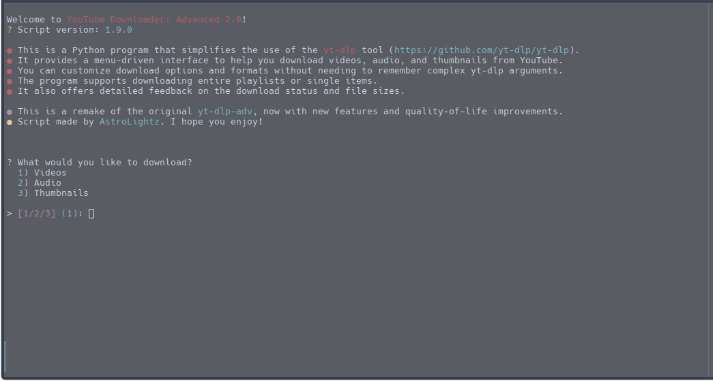
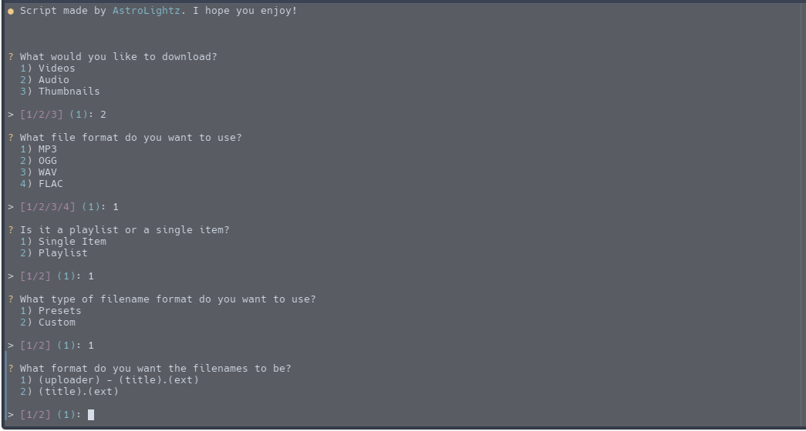
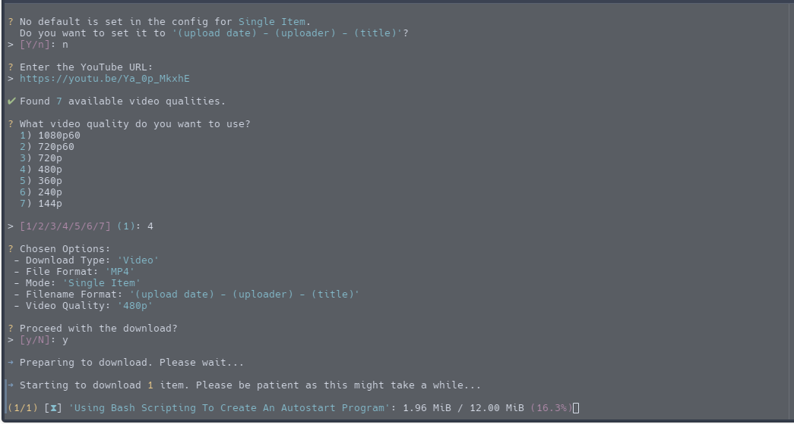
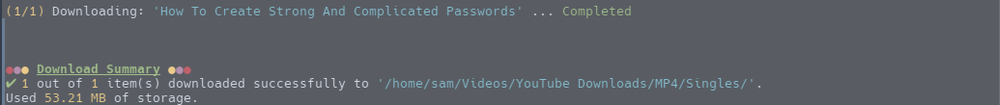

# YouTube Downloader: Advanced 2.0

Remake of the original yt-dlp-adv, written in Python.
A clean CLI script to download videos, audio, and thumbnails from YouTube.

This Script utilizes <b>[yt-dlp](https://github.com/yt-dlp/yt-dlp)</b> for downloading content from YouTube.

<!-- Table of Contents -->

- [Requirements](#requirements)
- [Installation](#installation)
- [Usage](#usage)
- [Features](#features)
- [Screenshots](#screenshots)
- [Project Stages](#project-stages)
- [License](#license)
- [Acknowledgements](#acknowledgements)

## Requirements

- A <b>Linux</b>-based system.
    - Windows WSL and macOS untested


- <b>Python 3.13</b> or higher
- <b>ImageMagick</b>

## Installation:

To install the program, run the following command in your terminal:

```shell
git clone https://github.com/AstroLightz/yt-dlp-adv2.git
cd yt-dlp-adv2
python3 -m venv .venv
source .venv/bin/activate
pip install -r requirements.txt
```

## Usage:

To use the program, run the following command in your terminal:

```shell
source .venv/bin/activate
python3 main.py
```

## Features

- Download videos, audio, and thumbnails from YouTube
- Download playlists or single items
- Choose what file format to use
- Choose filename format to use
    - e.g. (uploader) - (title).(ext)


- Dynamic directory location for each type of download
    - Music: ~/Music
    - Videos: ~/Videos
    - Artwork: ~/Pictures

- Custom download status messages
- See overview of download after download is complete

More features to come!

## Screenshots

### Main Menu



### Menu Options



### Download Status



### Download Summary



## Project Stages:

### Stage 1: Recreation (DONE)

- Recreation of the original yt-dlp-adv in Python 3
- Keep changes at minimal (Only change currently is swapping 'Single Item' and 'Playlist' positions and minor wording
  changes)

### Stage 2: Quality of Life Improvements (CURRENT)

- Minor changes to make the program more user-friendly
- Better documentation, more clear menus, etc.

### Stage 3: Additional Features

- Major changes to make the program more smooth and easy to use
- Potentially replace number input with Up/Down arrows + Enter navigation

More info on development can be found in the [TODO](./TODO) file.

<sup>1</sup> Failed downloads not tested yet. If you find a video or playlist that always fails, and you spot a bug with
the output/program, create an Issue and include the YT link.

## License:

This project is released under the [Unlicense](https://choosealicense.com/licenses/unlicense/). Check
the [LICENSE](./LICENSE) file for more information.

## Acknowledgements:

- [yt-dlp](https://github.com/yt-dlp/yt-dlp): Backbone of this whole project
- [Wand](https://pypi.org/project/Wand/): Thumbnail conversion
- [termcolor](https://pypi.org/project/termcolor/): Colored output