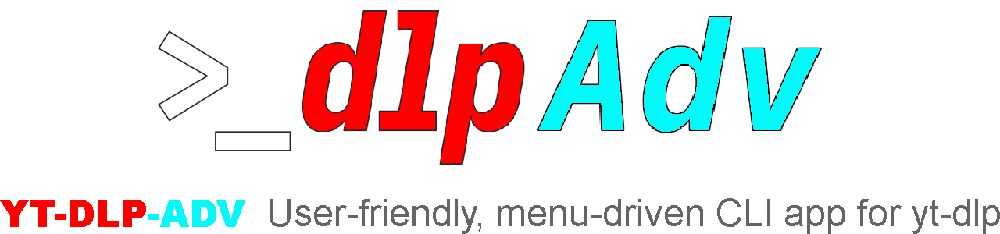
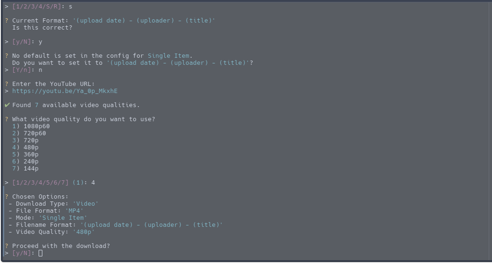
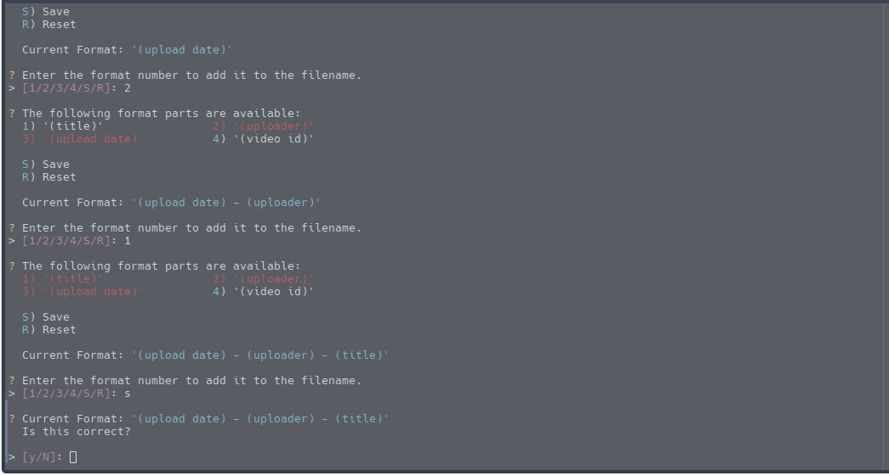
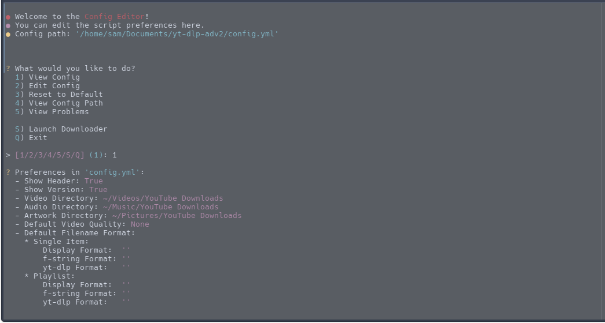
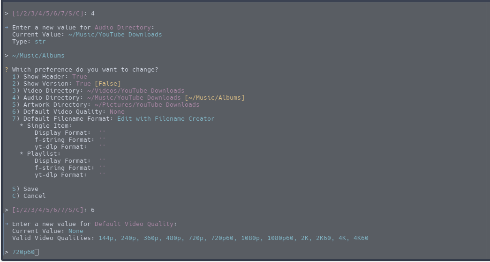
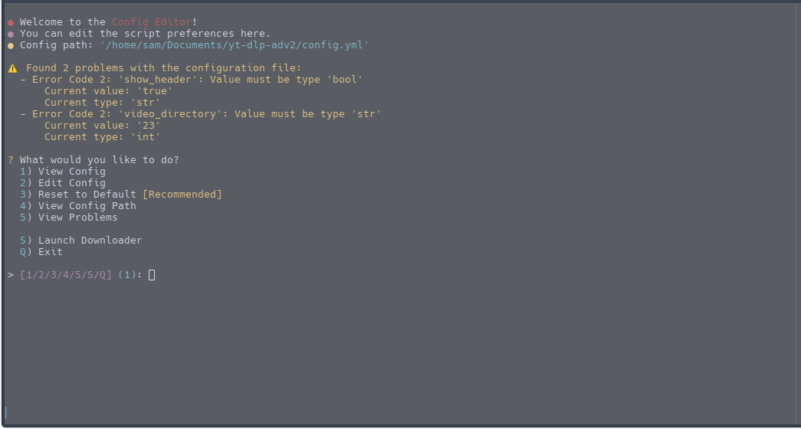

<div align="center">
  
</div>

<br><br>

yt-dlp-adv is a remake of the original yt-dlp-adv, written in Python.
A clean CLI script to download videos, audio, and thumbnails from YouTube.

This Script utilizes <b>[yt-dlp](https://github.com/yt-dlp/yt-dlp)</b> for downloading content from YouTube.

<!-- Table of Contents -->

- [Requirements](#requirements)
- [Installation](#installation)
    - [Automatic Installation (Experimental)](#automatic-installation-experimental)
    - [Manual Installation](#manual-installation)
- [Usage](#usage)
- [Features](#features)
  - [Filename Creator / Playlist Name Creator](#filename-creator--playlist-name-creator)
  - [Config Editor](#config-editor)
- [Screenshots](#screenshots)
- [License](#license)
- [Acknowledgements](#acknowledgements)

## Requirements

- An operating system with a <b>Unix filesystem</b>.[^1]

- <b>Python 3.12</b> or higher
- <b>FFmpeg</b>
- <b>ImageMagick</b>

[^1]: Windows WSL and macOS untested

## Installation:

### Automatic Installation (Experimental)

Install yt-dlp-adv2 using one of the following commands:

| Method   | Command                                                                                               |
|:---------|:------------------------------------------------------------------------------------------------------|
| **curl** | `bash -c "$(curl -fsSL https://raw.githubusercontent.com/AstroLightz/yt-dlp-adv2/master/install.sh)"` |
| **wget** | `bash -c "$(wget -O- https://raw.githubusercontent.com/AstroLightz/yt-dlp-adv2/master/install.sh)"`   |

The installation script can add an alias to your bashrc/zshrc file to execute yt-dlp-adv2:

```shell
alias yt-dlp-adv="\"/Install/Location/yt-dlp-adv/.venv/bin/python\" \"/Install/Location/yt-dlp-adv/main.py\""
```

### Manual Installation

To install the program manually, run the following command in your terminal:

```shell
git clone https://github.com/AstroLightz/yt-dlp-adv2.git
cd yt-dlp-adv2
python3 -m venv .venv
source .venv/bin/activate
pip install -r requirements.txt
```

Then see the [Usage](#usage) section below.

## Usage:

To use the program, run the following command in your terminal:

```shell
source .venv/bin/activate
python3 main.py
```

## Features

- Download videos, audio, and thumbnails from YouTube
- Download playlists or single items
- Choose what file format to use
- If you are downloading a playlist, choose a playlist name format
- Choose filename format to use
    - e.g. (uploader) - (title).(ext)


- Dynamic directory location for each type of download[^2]
    - Music: ~/Music/YouTube Downloads
    - Videos: ~/Videos/YouTube Downloads
    - Artwork: ~/Pictures/YouTube Downloads


- Custom download status messages
- See overview of download after download is complete

### Filename Creator / Playlist Name Creator

Don't like the default filename format presets? Make your own using the <b>Custom</b> option in the menu.

There are two modes to use:

- <b>Simple</b>: Menu-driven creation where you get to pick format parts to assemble your format.
- <b>Advanced</b>: You can enter your own output template. See
  the [yt-dlp documentation](https://github.com/yt-dlp/yt-dlp?tab=readme-ov-file#output-template) for more info on
  output templates.

Filename Creator can be accessed through the Downloader, Config Editor, or by passing `-f` or `--format-editor` as an
argument to `main.py`


Playlist Name Creator, like Filename Creator, allows you to make your own playlist name format.
Choose from <b>Simple</b> or <b>Advanced</b> mode to create your playlist name format.

Playlist Name Creator can be accessed through the Downloader when downloading a Playlist, Config Editor, or by
passing `-f` or `--format-editor` as an argument to `main.py`

### Config Editor

Customize how yt-dlp-adv works through the <b>Config Editor</b>. View, edit, and reset your config file through
user-friendly menus.

Your config file is stored in script's directory as `config.yml`.[^3]

Config Editor can be accessed by passing `-c` or `--config` as an argument to `main.py`

<br>

<b>Info on development can be found in the [TODO](./TODO) file.</b>

[^2]: Default download locations can be changed in the Config Editor.
[^3]: It is recommended to use the Config Editor for editing the config file. You are responsible for any edits made
outside the Config Editor.

## Screenshots

### Main Menu


### Menu Options


### Video Qualities



### Download Status


### Custom Presets using the Filename Creator



### Edit config options using the Config Editor



#### Making Changes / Video Qualities



#### Config Problems Handling




<br>

## License:

This project is released under the [Unlicense](https://choosealicense.com/licenses/unlicense/). Check
the [LICENSE](./LICENSE) file for more information.

## Acknowledgements:

- [yt-dlp](https://github.com/yt-dlp/yt-dlp): Backbone of this whole project
- [Wand](https://pypi.org/project/Wand/): Thumbnail conversion
- [termcolor](https://pypi.org/project/termcolor/): Colored output
- [ruamel.yaml](https://pypi.org/project/ruamel.yaml/): YAML loader/dumper